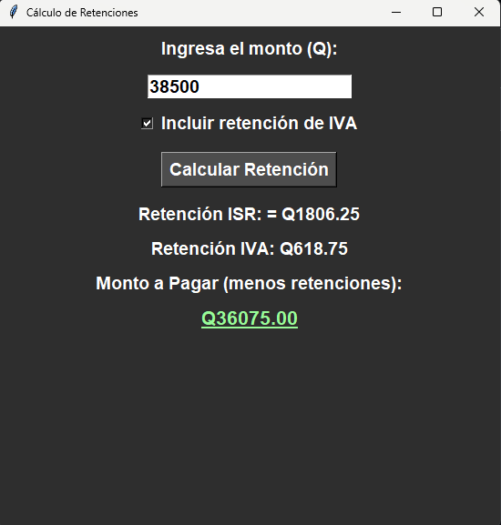

> [!IMPORTANT]
> Some parts of the code were created with help from ChatGPT. Each section includes a note to show whether it’s my original code or a contribution from ChatGPT.

# Account Assist
A customizable automation solution for accounting teams, enabling operators to focus on high-value tasks and minimize errors 

## APP Retention Calculator (ISR and IVA) for Guatemala
> [!NOTE]
> ChatGPT Code

### This Python desktop application, built with tkinter, calculates ISR and IVA (VAT) retentions on invoices based on Guatemala's tax regulations.

Features:
- ISR Retention Calculation: Applies a 5% rate on the calculated base up to Q30,000 and 7% on any excess, according to Guatemalan regulations.
- VAT Retention Calculation: Calculates a 15% retention on the total VAT. This calculation applies specifically to Special Taxpayers.
- User-Friendly Interface: Includes a checkbox to enable or disable VAT retention and provides a clear, detailed breakdown of results.
- This tool makes retention calculations quick and easy, ideal for supporting the accounting needs of small and medium-sized businesses in Guatemala.

# Contact Me

  
  

